# Razonamiento computacional y diseño de algoritmos

---

## 1. Introducción

La inteligencia artificial y la ciencia de datos requieren resolver problemas complejos, desde procesar grandes volúmenes de información hasta entrenar modelos de aprendizaje automático. No obstante, el **razonamiento computacional** es una disciplina general que trasciende estas áreas, pues permite descomponer cualquier problema y formular soluciones estructuradas para que una computadora pueda ejecutarlas con precisión.

Este proceso se apoya principalmente en dos estrategias:

1. **Abstracción:** Identificar los aspectos esenciales de una situación e ignorar los detalles secundarios para concentrarse en la información crítica.
2. **Descomposición:** Dividir un problema complejo en partes más pequeñas y manejables que puedan resolverse paso a paso.

---

## 2. Concepto de algoritmo y granularidad

Un **algoritmo** es un conjunto ordenado, finito y no ambiguo de instrucciones lógicas que conducen a la solución de un problema específico. Para ser formalmente correcto, todo algoritmo debe cumplir tres propiedades fundamentales:

- **Preciso:** Cada paso debe estar definido con exactitud, sin margen de interpretación.
- **Determinista:** Al procesar las mismas entradas, debe generar invariablemente el mismo resultado.
- **Finito:** Debe concluir tras un número determinado de operaciones.

### 2.1 El nivel de granularidad

Al diseñar un algoritmo, el **nivel de granularidad** representa el grado de detalle con el que se especifican las instrucciones:

- **Granularidad baja (macro-pasos):** Describe operaciones generales (por ejemplo, *"limpiar la base de datos"*). Es útil para conceptualizar la arquitectura global de una solución, aunque una computadora no puede ejecutar directamente instrucciones tan amplias.
- **Granularidad alta (micro-pasos):** Expresa operaciones elementales y atómicas, al nivel de instrucciones aritméticas y lógicas que el procesador interpreta directamente.

### 2.2 Algoritmos en la vida cotidiana

Antes de codificar en un entorno computacional, conviene observar cómo estructuramos actividades cotidianas mediante tres patrones básicos:

**1. Flujo secuencial (cambio de un foco):**

1. Comprobar si hay electricidad en la habitación.
2. Conseguir una escalera y un foco nuevo.
3. Apagar el interruptor de la luz.
4. Desenroscar el foco fundido girando hacia la izquierda.
5. Enroscar el foco nuevo girando hacia la derecha.
6. Encender el interruptor para verificar que funcione.
7. Concluir la tarea.

En este caso, las acciones se suceden de forma estrictamente lineal, ejecutando una instrucción detrás de otra.

**2. Toma de decisiones (preparación de café):**

1. Servir agua caliente en una taza limpia.
2. Evaluar: ¿Desea azúcar?

   - **Sí:** Agregar una cucharada de azúcar y mezclar.
   - **No:** Mezclar directamente.

3. Concluir la preparación.

En este flujo se introduce una bifurcación condicional basada en una preferencia.

**3. Estructura iterativa (lavado de platos):**

1. Tomar un plato sucio de la pila.
2. Enjabonar y enjuagar el plato.
3. Evaluar: ¿Quedan platos sucios en la pila?

   - **Sí:** Regresar al paso 1.
   - **No:** Continuar al paso 4.

4. Secarse las manos y finalizar.

Al retornar al primer paso mientras existan platos pendientes, se establece un ciclo de repetición.

### 2.3 Variables, constantes, tipos de datos y operadores

**Variables y constantes:**

- **Variables:** Espacios de memoria identificados con un nombre cuyo contenido puede cambiar durante la ejecución del programa (por ejemplo, `edad = 25` y más adelante `edad = 26`).
- **Constantes:** Espacios de memoria cuyo valor se define una sola vez al inicio y permanece inalterable durante toda la ejecución (por ejemplo, `PI = 3.14159` o `TASA_IVA = 0.16`).

**Buenas prácticas de nomenclatura:**
Es recomendable emplear nombres descriptivos que expliquen la función del identificador, evitando letras sueltas y sin contexto. En la práctica profesional se utilizan convenciones como **`snake_case`** (`calificacion_final`) o **`camelCase`** (`calificacionFinal`).

**Tipos de datos básicos:**

- **Numéricos:** Enteros (`15`) o decimales de punto flotante (`3.14`).
- **Cadenas de caracteres (texto):** Delimitadas siempre entre comillas (`"Hola Mundo"`).

**Operadores:**

- **Aritméticos:** Suma (`+`), resta (`-`), multiplicación (`*`), división (`/`) y módulo o residuo (`MOD` o `%`).
- **Concatenación:** Permite unir texto y variables usando el signo `+` (por ejemplo, `"Tienes " + edad + " años"`).
- **Lógicos:** Operadores `Y` (AND), `O` (OR) y `NO` (NOT) para articular condiciones compuestas.

**Diferencia clave: Asignación vs. Comparación (`=` vs `==`):**

- Un solo signo igual (`=`) se emplea para **asignar** un dato a una variable (por ejemplo, `saldo = 1000`).
- El doble signo igual (`==`) se utiliza para **comparar** dos valores dentro de una condición lógica (por ejemplo, `SI opcion == 1`).

---

## 3. Construcción gradual de algoritmos y DFDs

Antes de trazar un diagrama, conviene seguir una metodología estructurada: comprender el problema, identificar las entradas requeridas, definir las operaciones o fórmulas necesarias y especificar las salidas esperadas. En esta sección se aborda la construcción progresiva de algoritmos mediante pseudocódigo, diagramas de flujo de datos (DFD) y tablas de prueba de escritorio.

**Reglas para líneas de flujo y conectores:**

- El flujo natural se orienta de arriba hacia abajo y de izquierda a derecha.
- Las líneas de flujo no deben cruzarse; cuando el diagrama se extiende o requiere enlazar puntos distantes, se utilizan conectores dentro de la misma página (círculo con identificador) o conectores fuera de página (pentágono).
- A excepción del inicio y el fin, cada bloque debe tener al menos una línea de entrada y una de salida para evitar trayectorias inconclusas.

**La prueba de escritorio:**
Consiste en una verificación manual donde se simula la ejecución del algoritmo mediante una tabla, registrando paso a paso el estado de las variables y las salidas emitidas para comprobar su correcto funcionamiento y evaluar casos extremos.

A continuación se ilustra la prueba de escritorio para un ciclo que cuenta del 1 al 3 (`PARA i = 1 HASTA 3`):

| Vuelta / Paso | ¿Límite alcanzado? | Variable `i` (Memoria) | Acción en pantalla (Salida) |
| :---: | :---: | :---: | :--- |
| Inicio | NO | 1 | "Imprimiendo 1" |
| Incremento | NO | 2 | "Imprimiendo 2" |
| Incremento | NO | 3 | "Imprimiendo 3" |
| Incremento | **SÍ (Límite)** | 4 | *El programa sale del ciclo* |

### El esqueleto base (Estructura vacía)

Todo algoritmo requiere un punto de inicio y un punto de fin bien delimitados. En los diagramas de flujo se representan mediante el **óvalo** (`INICIO` y `FIN`), que formaliza el inicio de la ejecución y la liberación final de los recursos del sistema.

**Pseudocódigo:**
```text
INICIO
FIN
```
**Diagrama de flujo:**
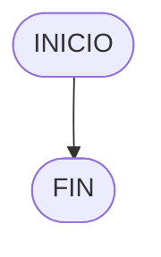
```mermaid
graph TD
    A(["INICIO"]) --> B(["FIN"])
```

---

### Algoritmos con instrucciones de salida

Para enviar información desde el programa hacia el usuario o hacia otros dispositivos se utiliza el símbolo de salida, representado aquí con el **trapecio de salida** `[\ ... /]`. Esta instrucción despliega resultados en pantalla, genera impresiones o envía mensajes de estado.

#### Ejemplo 1: Saludo en pantalla
**Descripción:** Mostrar en pantalla un mensaje de bienvenida estático con el texto `"Hola Alexander"`.

**Pseudocódigo:**
```text
INICIO
    IMPRIMIR "Hola Alexander"
FIN
```
**Diagrama de flujo:**
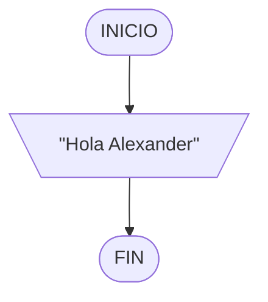
```mermaid
graph TD
    A(["INICIO"]) --> B[\"#quot;Hola Alexander#quot;"/]
    B --> C(["FIN"])
```
**Prueba de escritorio:**
| Paso | Acción en pantalla (Salida) |
| :---: | :--- |
| Inicio | *Ninguna* |
| Imprimir | "Hola Alexander" |
| Fin | *Programa terminado* |

#### Ejemplo 2: Mensaje de estado de un proceso
**Descripción:** Notificar al usuario que una tarea en segundo plano ha comenzado mediante la impresión de un mensaje informativo.

**Pseudocódigo:**
```text
INICIO
    IMPRIMIR "Iniciando entrenamiento del modelo..."
FIN
```
**Diagrama de flujo:**
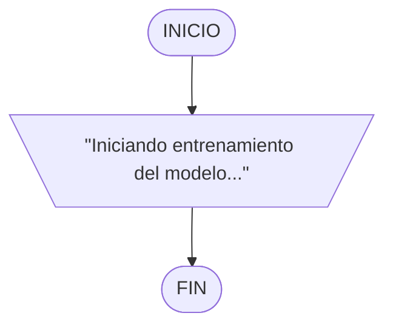
```mermaid
graph TD
    A(["INICIO"]) --> B[\"#quot;Iniciando entrenamiento del modelo...#quot;"/]
    B --> C(["FIN"])
```
**Prueba de escritorio:**
| Paso | Acción en pantalla (Salida) |
| :---: | :--- |
| Inicio | *Ninguna* |
| Imprimir | "Iniciando entrenamiento del modelo..." |
| Fin | *Programa terminado* |

#### Ejemplo 3: Emisión de un código de error
**Descripción:** Mostrar un código de error estandarizado en pantalla cuando no se localiza un recurso o archivo necesario.

**Pseudocódigo:**
```text
INICIO
    IMPRIMIR "Error 404: Dataset no encontrado"
FIN
```
**Diagrama de flujo:**
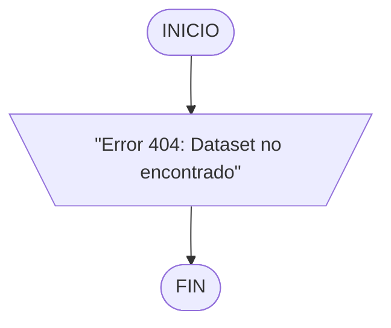
```mermaid
graph TD
    A(["INICIO"]) --> B[\"#quot;Error 404: Dataset no encontrado#quot;"/]
    B --> C(["FIN"])
```
**Prueba de escritorio:**
| Paso | Acción en pantalla (Salida) |
| :---: | :--- |
| Inicio | *Ninguna* |
| Imprimir | "Error 404: Dataset no encontrado" |
| Fin | *Programa terminado* |

---

### Algoritmos con captura de datos (Entrada y Salida)

Para recibir información proporcionada por el usuario o por sensores se utiliza el **paralelogramo** `[ / ... / ]`, que representa la operación de lectura (`LEER`) y almacena los datos ingresados en variables de memoria.

#### Ejemplo 1: Lectura y confirmación de edad
**Descripción:** Solicitar la edad de un paciente y mostrarla en pantalla junto con un mensaje de confirmación.

**Pseudocódigo:**
```text
INICIO
    LEER edad
    IMPRIMIR "Tu edad registrada es: " + edad
FIN
```
**Diagrama de flujo:**
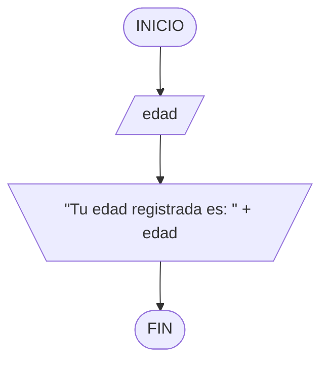
```mermaid
graph TD
    A(["INICIO"]) --> B[/"edad"/]
    B --> C[\"#quot;Tu edad registrada es: #quot; + edad"/]
    C --> D(["FIN"])
```
**Prueba de escritorio:**
| Paso | Variable `edad` | Acción en pantalla (Salida) |
| :---: | :---: | :--- |
| Leer | **25** *(ingreso)*| *Esperando entrada del teclado* |
| Imprimir | 25 | "Tu edad registrada es: 25" |

#### Ejemplo 2: Concatenación de fecha y ciudad
**Descripción:** Solicitar el nombre de una ciudad y el año en curso para construir un encabezado formal mediante concatenación de texto.

**Pseudocódigo:**
```text
INICIO
    LEER ciudad
    LEER anio
    IMPRIMIR ciudad + ", Col. a 18 de agosto de " + anio
FIN
```
**Diagrama de flujo:**
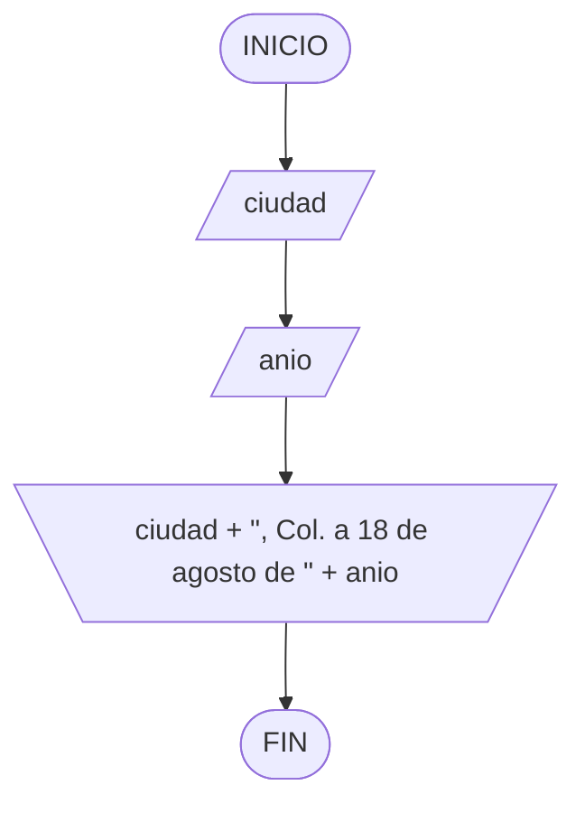
```mermaid
graph TD
    A(["INICIO"]) --> B[/"ciudad"/]
    B --> B2[/"anio"/]
    B2 --> C[\"ciudad + #quot;, Col. a 18 de agosto de #quot; + anio"/]
    C --> D(["FIN"])
```
**Prueba de escritorio:**
| Paso | Var `ciudad` | Var `anio` | Acción en pantalla (Salida) |
| :---: | :---: | :---: | :--- |
| Leer | **"Colima"** | - | *Esperando texto* |
| Leer | "Colima" | **2026** | *Esperando número* |
| Imprimir | "Colima" | 2026 | "Colima, Col. a 18 de agosto de 2026" |

#### Ejemplo 3: Carga de modelo por nombre
**Descripción:** Solicitar el nombre de un modelo predictivo e imprimir un mensaje confirmando que se encuentra listo para su utilización.

**Pseudocódigo:**
```text
INICIO
    LEER nombre_modelo
    IMPRIMIR "El modelo " + nombre_modelo + " está listo para usarse."
FIN
```
**Diagrama de flujo:**
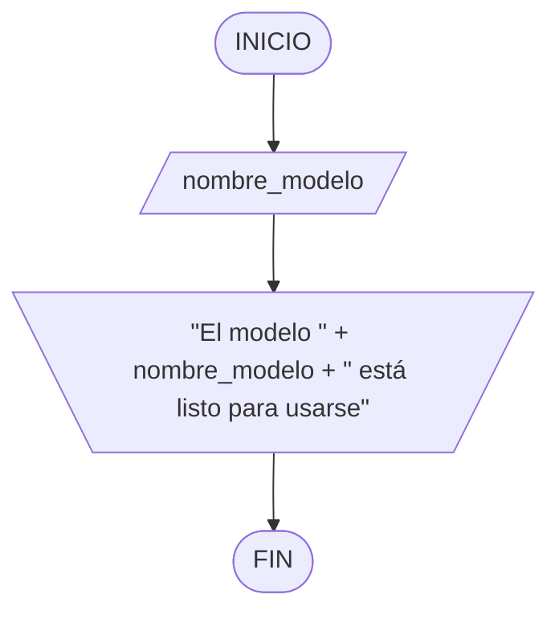
```mermaid
graph TD
    A(["INICIO"]) --> B[/"nombre_modelo"/]
    B --> C[\"#quot;El modelo #quot; + nombre_modelo + #quot; está listo para usarse#quot;"/]
    C --> D(["FIN"])
```
**Prueba de escritorio:**
| Paso | Var `nombre_modelo` | Acción en pantalla (Salida) |
| :---: | :---: | :--- |
| Leer | **"Regresión"** | *Esperando texto* |
| Imprimir | "Regresión" | "El modelo Regresión está listo para usarse." |

---

### Algoritmos con Entrada, Proceso y Salida

El **rectángulo** `[ ]` representa operaciones de proceso, tales como cálculos aritméticos, asignaciones y transformaciones de datos que modifican el estado de las variables en memoria.

#### Ejemplo 1: Cálculo de edad según el año de nacimiento
**Descripción:** Solicitar el año de nacimiento del usuario, restar dicho valor del año actual (2026) y mostrar la edad resultante.

**Pseudocódigo:**
```text
INICIO
    LEER anio_nacimiento
    edad_calculada = 2026 - anio_nacimiento
    IMPRIMIR "Tienes " + edad_calculada + " años."
FIN
```
**Diagrama de flujo:**
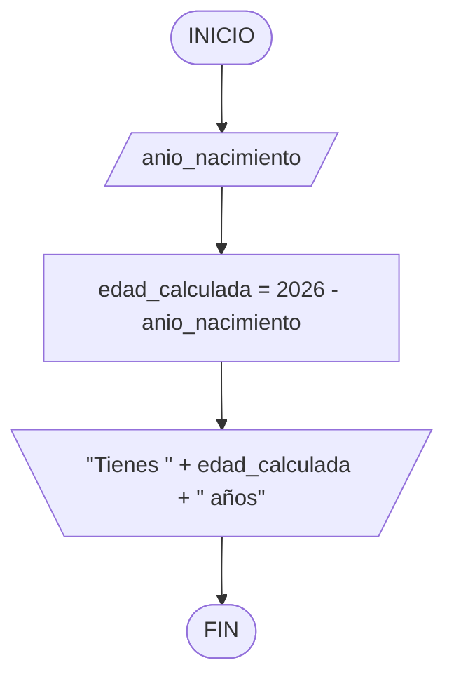
```mermaid
graph TD
    A(["INICIO"]) --> B[/"anio_nacimiento"/]
    B --> C["edad_calculada = 2026 - anio_nacimiento"]
    C --> D[\"#quot;Tienes #quot; + edad_calculada + #quot; años#quot;"/]
    D --> E(["FIN"])
```
**Prueba de escritorio:**
| Paso | Var `anio_nacimiento` | Var `edad_calculada` | Acción en pantalla (Salida) |
| :---: | :---: | :---: | :--- |
| Leer | **2000** | - | *Esperando año numérico* |
| Proceso | 2000 | **26** *(2026-2000)* | *Operación interna en memoria* |
| Imprimir | 2000 | 26 | "Tienes 26 años." |

#### Ejemplo 2: Promedio de tres calificaciones
**Descripción:** Leer tres notas parciales, calcular su promedio aritmético mediante suma y división, y mostrar el promedio final.

**Pseudocódigo:**
```text
INICIO
    LEER calif_1
    LEER calif_2
    LEER calif_3
    promedio = (calif_1 + calif_2 + calif_3) / 3
    IMPRIMIR "El promedio final es: " + promedio
FIN
```
**Diagrama de flujo:**
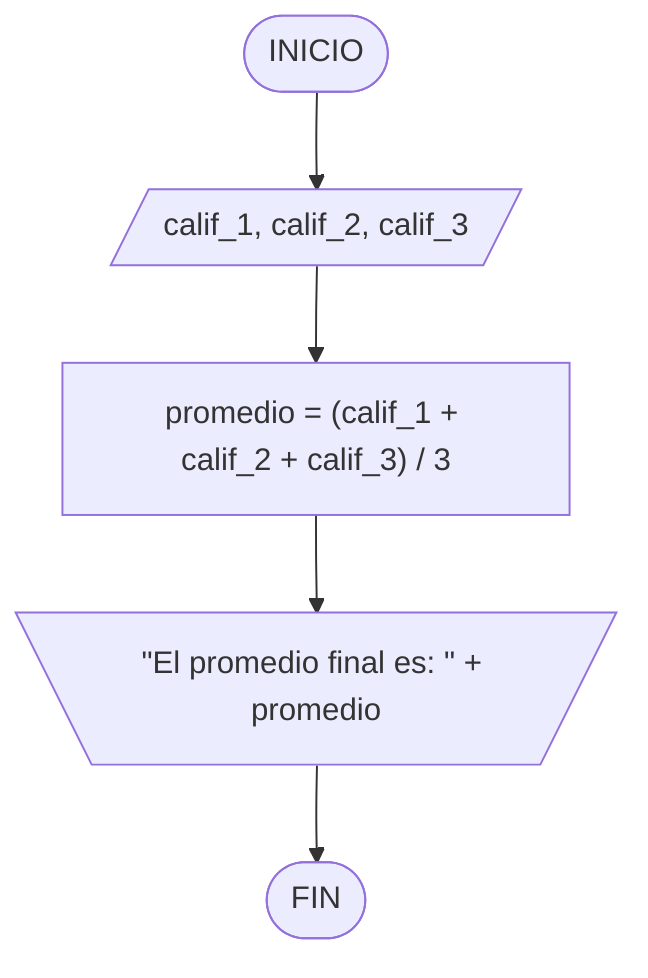
```mermaid
graph TD
    A(["INICIO"]) --> B[/"calif_1, calif_2, calif_3"/]
    B --> C["promedio = (calif_1 + calif_2 + calif_3) / 3"]
    C --> D[\"#quot;El promedio final es: #quot; + promedio"/]
    D --> E(["FIN"])
```
**Prueba de escritorio:**
| Paso | `calif_1` | `calif_2` | `calif_3` | `promedio` | Pantalla |
| :---: | :---: | :---: | :---: | :---: | :--- |
| Leer | **8** | **9** | **10** | - | *Esperando 3 datos* |
| Proceso | 8 | 9 | 10 | **9** | *Cálculo interno* |
| Imprimir| 8 | 9 | 10 | 9 | "El promedio final es: 9" |

#### Ejemplo 3: Área de un terreno rectangular
**Descripción:** Solicitar la base y la altura de un terreno rectangular, multiplicar ambas dimensiones y mostrar el área en metros cuadrados.

**Pseudocódigo:**
```text
INICIO
    LEER base
    LEER altura
    area = base * altura
    IMPRIMIR "El área total es de: " + area + " metros cuadrados"
FIN
```
**Diagrama de flujo:**
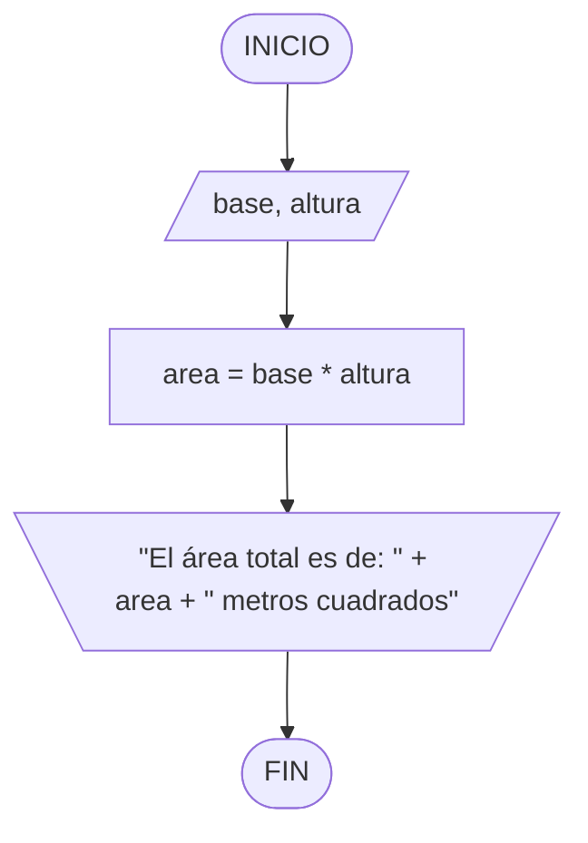
```mermaid
graph TD
    A(["INICIO"]) --> B[/"base, altura"/]
    B --> C["area = base * altura"]
    C --> D[\"#quot;El área total es de: #quot; + area + #quot; metros cuadrados#quot;"/]
    D --> E(["FIN"])
```
**Prueba de escritorio:**
| Paso | Var `base` | Var `altura` | Var `area` | Acción en pantalla |
| :---: | :---: | :---: | :---: | :--- |
| Leer | **10** | **5** | - | *Esperando 2 datos* |
| Proceso | 10 | 5 | **50** | *Cálculo interno* |
| Imprimir | 10 | 5 | 50 | "El área total es de: 50 metros cuadrados" |

---

## 4. Estructuras condicionales (toma de decisiones)

El **rombo** `{ }` evalúa una expresión lógica que solo puede resultar verdadera o falsa, bifurcando el flujo del programa en dos caminos independientes según el resultado. A continuación se presentan casos con decisiones simples, anidadas y combinadas mediante operadores lógicos.

### Condicional simple: Par o Impar
**Descripción:** Determinar si un número entero es par o impar evaluando si el residuo de su división entre 2 (`MOD`) es igual a cero.

**Pseudocódigo:**
```text
INICIO
    LEER numero
    residuo = numero MOD 2
    SI residuo == 0 ENTONCES
        IMPRIMIR "El número es Par"
    SINO
        IMPRIMIR "El número es Impar"
    FIN SI
FIN
```
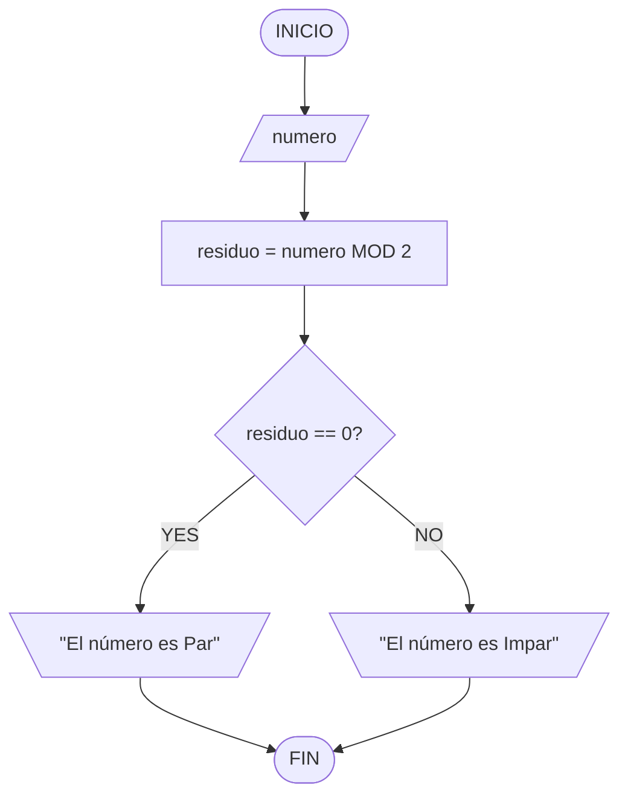
```mermaid
graph TD
    A(["INICIO"]) --> B[/"numero"/]
    B --> C["residuo = numero MOD 2"]
    C --> D{"residuo == 0?"}
    D -- YES --> E[\"#quot;El número es Par#quot;"/]
    D -- NO --> F[\"#quot;El número es Impar#quot;"/]
    E --> G(["FIN"])
    F --> G(["FIN"])
```
**Prueba de escritorio (evaluando el valor impar 7):**
| Paso | `numero` | `residuo` | Condición (`residuo == 0`) | Pantalla |
| :---: | :---: | :---: | :---: | :--- |
| Leer | **7** | - | - | *Esperando dato* |
| Proceso | 7 | **1** | - | *Cálculo interno* |
| Rombo | 7 | 1 | **NO (Falso)** | *Bifurca al Sino* |
| Imprimir| 7 | 1 | - | "El número es Impar" |

### Condicionales anidados: Clasificar un número
**Descripción:** Clasificar un número ingresado indicando si es positivo, negativo o exactamente cero mediante dos decisiones consecutivas.

**Pseudocódigo:**
```text
INICIO
    LEER valor
    SI valor == 0 ENTONCES
        IMPRIMIR "El valor es Cero"
    SINO
        SI valor > 0 ENTONCES
            IMPRIMIR "Es Positivo"
        SINO
            IMPRIMIR "Es Negativo"
        FIN SI
    FIN SI
FIN
```
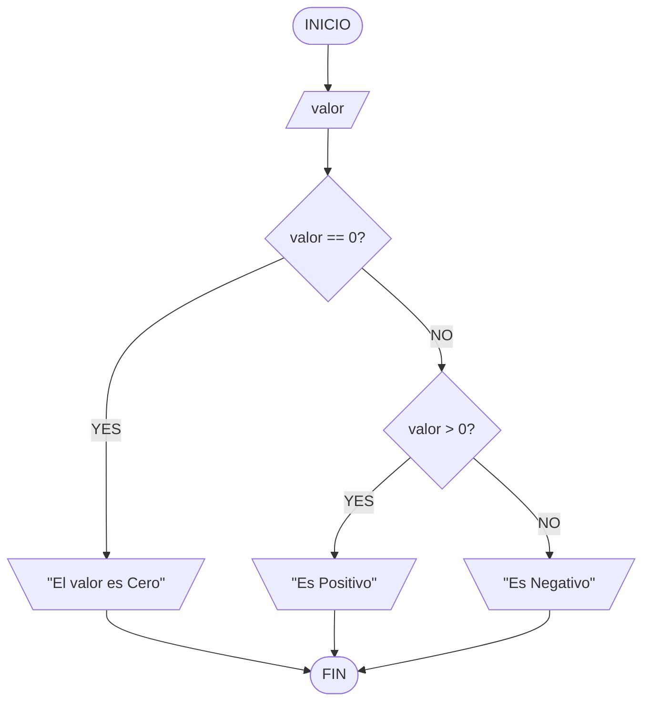
```mermaid
graph TD
    A(["INICIO"]) --> B[/"valor"/]
    B --> C{"valor == 0?"}
    C -- YES --> D[\"#quot;El valor es Cero#quot;"/]
    C -- NO --> E{"valor > 0?"}
    E -- YES --> F[\"#quot;Es Positivo#quot;"/]
    E -- NO --> G[\"#quot;Es Negativo#quot;"/]
    D --> H(["FIN"])
    F --> H
    G --> H
```
**Prueba de escritorio (evaluando el valor negativo -5):**
| Paso | `valor` | Condición 1 (`valor == 0`) | Condición 2 (`valor > 0`) | Pantalla |
| :---: | :---: | :---: | :---: | :--- |
| Leer | **-5** | - | - | *Esperando dato* |
| Rombo 1| -5 | **NO (Falso)** | - | *Bifurca a la rama alternativa* |
| Rombo 2| -5 | - | **NO (Falso)** | *Bifurca al Sino interno* |
| Imprimir| -5 | - | - | "Es Negativo" |

### Operadores lógicos (Y, O, NO): Evaluación conjunta
**Descripción:** Aprobar a un estudiante únicamente cuando su calificación sea mayor o igual a 6 y su asistencia supere el 80%, combinando ambas condiciones con el operador `Y`.

**Pseudocódigo:**
```text
INICIO
    LEER calificacion
    LEER asistencia
    SI calificacion >= 6 Y asistencia > 80 ENTONCES
        IMPRIMIR "Aprobado"
    SINO
        IMPRIMIR "Reprobado"
    FIN SI
FIN
```
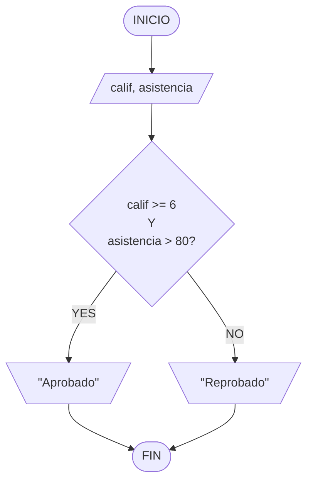
```mermaid
graph TD
    A(["INICIO"]) --> B[/"calif, asistencia"/]
    B --> C{"calif >= 6<br>Y<br>asistencia > 80?"}
    C -- YES --> D[\"#quot;Aprobado#quot;"/]
    C -- NO --> E[\"#quot;Reprobado#quot;"/]
    D --> F(["FIN"])
    E --> F(["FIN"])
```
**Prueba de escritorio (calificación aprobatoria pero asistencia insuficiente: 9 y 70):**
| Paso | `calif` | `asistencia` | Condición lógica conjunta (`Y`) | Pantalla |
| :---: | :---: | :---: | :---: | :--- |
| Leer | **9** | **70** | - | *Esperando datos* |
| Rombo | 9 | 70 | **NO (Falso, pues 70 no es > 80)**| *Bifurca al Sino* |
| Imprimir| 9 | 70 | - | "Reprobado" |

---

## 5. Estructuras iterativas (ciclos)

Las estructuras iterativas permiten repetir un bloque de instrucciones de manera controlada. Según el momento en que se evalúa la condición de permanencia y el conocimiento previo del número de repeticiones, se dividen en tres tipos principales.

### 5.1 El ciclo MIENTRAS (bucle While)

Evalúa la condición al **inicio**, antes de ejecutar las instrucciones internas:
- **Comportamiento:** Si la condición es verdadera, ejecuta el cuerpo del ciclo; si es falsa desde el primer instante, no entra al bloque.
- **Caso de uso:** Procesos donde el número total de repeticiones no se conoce de antemano y depende de una condición dinámica.

#### Ejercicio MIENTRAS 1: Promedio de N números
**Descripción:** Solicitar al usuario la cantidad total de números que desea ingresar, acumular sus valores mediante un ciclo y calcular el promedio final.

**Pseudocódigo:**
```text
INICIO
    LEER cantidad_n
    contador = 1
    suma = 0
    MIENTRAS contador <= cantidad_n HACER
        LEER numero_actual
        suma = suma + numero_actual
        contador = contador + 1
    FIN MIENTRAS
    promedio = suma / cantidad_n
    IMPRIMIR "La media es: " + promedio
FIN
```
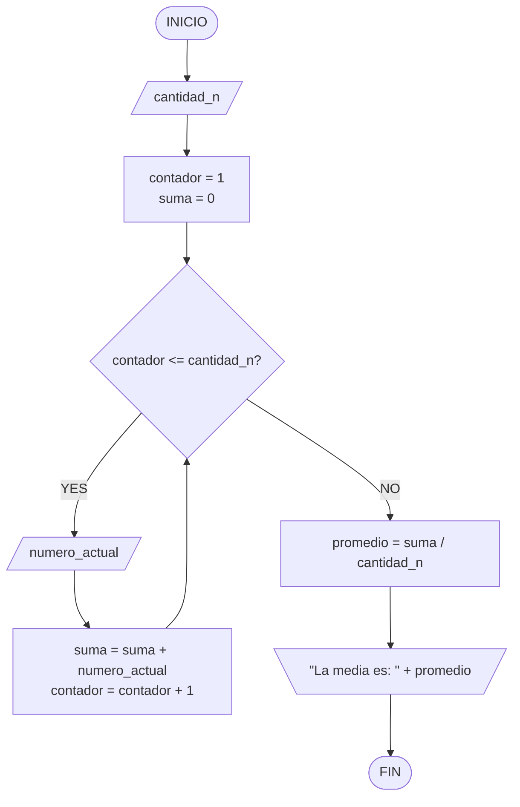
```mermaid
graph TD
    A(["INICIO"]) --> B[/"cantidad_n"/]
    B --> C["contador = 1<br>suma = 0"]
    C --> D{"contador <= cantidad_n?"}
    D -- YES --> E[/"numero_actual"/]
    E --> F["suma = suma + numero_actual<br>contador = contador + 1"]
    F --> D
    D -- NO --> G["promedio = suma / cantidad_n"]
    G --> H[\"#quot;La media es: #quot; + promedio"/]
    H --> I(["FIN"])
```
**Prueba de escritorio (promediando 2 números: 8 y 10):**
| Vuelta | `cantidad_n` | `contador` | `suma` | `numero_actual` | Condición (`<= n`) | Pantalla |
| :---: | :---: | :---: | :---: | :---: | :---: | :--- |
| Inicio | 2 | 1 | 0 | - | - | *Esperando N* |
| 1 | 2 | 1 | 0 | **8** | **SÍ (1 <= 2)** | *Esperando número* |
| 1 (Fin) | 2 | **2** | **8** | 8 | - | - |
| 2 | 2 | 2 | 8 | **10** | **SÍ (2 <= 2)** | *Esperando número* |
| 2 (Fin) | 2 | **3** | **18** | 10 | - | - |
| 3 | 2 | 3 | 18 | - | **NO (3 <= 2 es Falso)** | *Sale del ciclo* |
| Salida | 2 | 3 | 18 | - | - | "La media es: 9" |

#### Ejercicio MIENTRAS 2: Conteo e impresión de pares del 2 al 10
**Descripción:** Desplegar los números pares entre 2 y 10 incrementando de dos en dos, y mostrar al finalizar el total de números impresos.

**Pseudocódigo:**
```text
INICIO
    numero = 2
    cantidad_pares = 0
    MIENTRAS numero <= 10 HACER
        IMPRIMIR "Encontré el par: " + numero
        cantidad_pares = cantidad_pares + 1
        numero = numero + 2
    FIN MIENTRAS
    IMPRIMIR "Total de pares: " + cantidad_pares
FIN
```
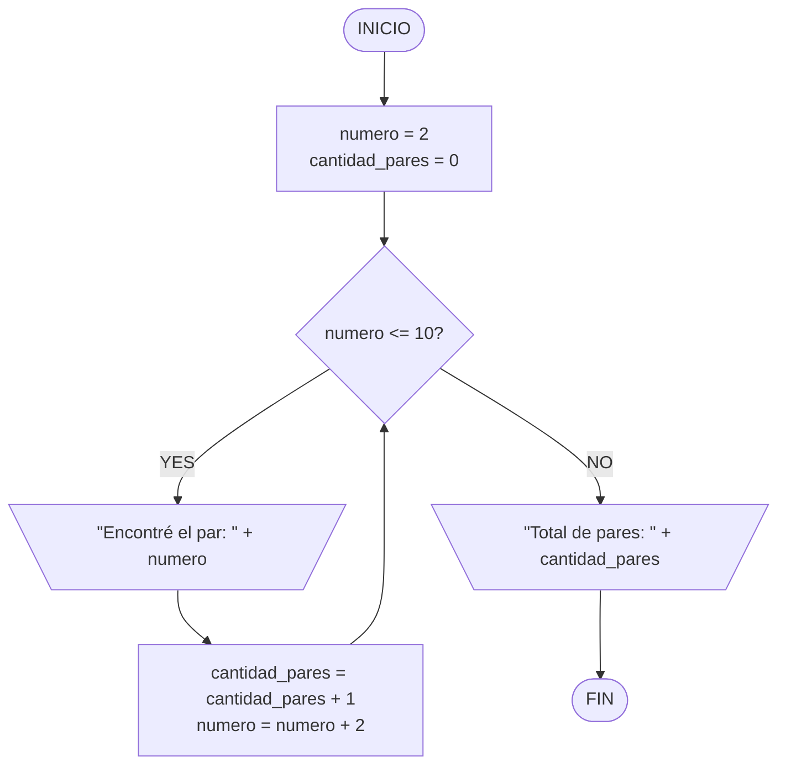
```mermaid
graph TD
    A(["INICIO"]) --> B["numero = 2<br>cantidad_pares = 0"]
    B --> C{"numero <= 10?"}
    C -- YES --> D[\"#quot;Encontré el par: #quot; + numero"/]
    D --> E["cantidad_pares = cantidad_pares + 1<br>numero = numero + 2"]
    E --> C
    C -- NO --> F[\"#quot;Total de pares: #quot; + cantidad_pares"/]
    F --> G(["FIN"])
```
**Prueba de escritorio:**
| Vuelta | `numero` | `cantidad_pares` | Condición (`<= 10`) | Pantalla |
| :---: | :---: | :---: | :---: | :--- |
| Inicio | 2 | 0 | - | - |
| 1 | 2 | 0 | **SÍ (2 <= 10)** | "Encontré el par: 2" |
| 1 (Fin) | **4** | **1** | - | - |
| *(...)* | *...* | *...* | *...* | *"Encontré el par: 4, 6, 8"* |
| Última | 10 | 4 | **SÍ (10 <= 10)**| "Encontré el par: 10" |
| Ú. (Fin) | **12** | **5** | - | - |
| Salida | 12 | 5 | **NO (12 <= 10)**| "Total de pares: 5" |

#### Ejercicio MIENTRAS 3: Lectura con valor centinela ("SALIR")
**Descripción:** Recibir palabras de forma continua hasta que el usuario ingrese el término `"SALIR"`, momento en el cual se interrumpe la repetición.

**Pseudocódigo:**
```text
INICIO
    LEER palabra
    MIENTRAS palabra != "SALIR" HACER
        IMPRIMIR "Procesando: " + palabra
        LEER palabra
    FIN MIENTRAS
    IMPRIMIR "Proceso finalizado"
FIN
```
**Prueba de escritorio (ingreso de "Hola" y posteriormente "SALIR"):**
| Vuelta | `palabra` | Condición (`!= "SALIR"`) | Pantalla |
| :---: | :---: | :---: | :--- |
| Inicio | **"Hola"** | - | *Esperando texto* |
| 1 | "Hola" | **SÍ ("Hola" != "SALIR")** | "Procesando: Hola" |
| 1 (Fin) | **"SALIR"** | - | *Esperando texto* |
| 2 | "SALIR" | **NO ("SALIR" != "SALIR" es Falso)** | *Sale del ciclo* |
| Salida | "SALIR" | - | "Proceso finalizado" |

---

### 5.2 El ciclo HACER MIENTRAS (bucle Do-While)

Evalúa la condición al **final** del bloque:
- **Comportamiento:** Ejecuta las instrucciones al menos una vez antes de verificar si debe repetir el ciclo.
- **Caso de uso:** Validación de datos de entrada y despliegue recurrente de menús interactivos.

#### Ejercicio HACER MIENTRAS 1: Validación de calificación en rango (0 a 10)
**Descripción:** Solicitar una calificación numérica y volver a pedirla mientras el valor ingresado se encuentre fuera del rango permitido (0 a 10).

**Pseudocódigo:**
```text
INICIO
    HACER
        IMPRIMIR "Ingresa una calificación (0 a 10):"
        LEER calificacion
    MIENTRAS calificacion < 0 O calificacion > 10
    IMPRIMIR "Calificación válida guardada"
FIN
```
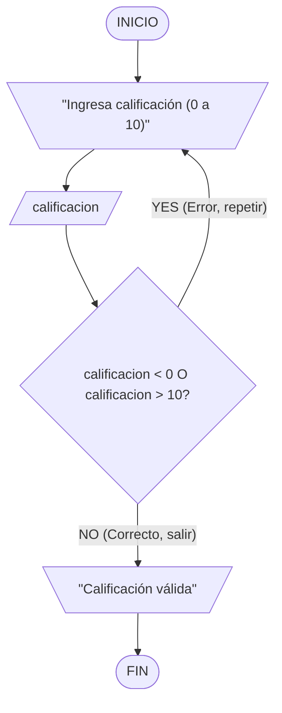
```mermaid
graph TD
    A(["INICIO"]) --> B[\"#quot;Ingresa calificación (0 a 10)#quot;"/]
    B --> C[/"calificacion"/]
    C --> D{"calificacion < 0 O calificacion > 10?"}
    D -- YES (Error, repetir) --> B
    D -- NO (Correcto, salir) --> E[\"#quot;Calificación válida#quot;"/]
    E --> F(["FIN"])
```
**Prueba de escritorio (entradas: -5, luego 15, y finalmente 8):**
| Vuelta | Acción | `calificacion` | Condición (`< 0 O > 10`) | Pantalla |
| :---: | :---: | :---: | :---: | :--- |
| 1 | Leer | **-5** | **SÍ (-5 < 0 es Verdadero)** | "Ingresa calificación..." |
| 2 | Leer | **15** | **SÍ (15 > 10 es Verdadero)** | "Ingresa calificación..." |
| 3 | Leer | **8** | **NO (Falso, valor válido)** | "Ingresa calificación..." |
| Salida| Imprimir | 8 | - | "Calificación válida" |

#### Ejercicio HACER MIENTRAS 2: Menú interactivo de opciones
**Descripción:** Desplegar un menú con tres opciones y reiterar la presentación hasta que el usuario elija la opción de salida (3).

**Pseudocódigo:**
```text
INICIO
    HACER
        IMPRIMIR "1. Sumar"
        IMPRIMIR "2. Restar"
        IMPRIMIR "3. Salir"
        LEER opcion
    MIENTRAS opcion != 3
    IMPRIMIR "Apagando sistema"
FIN
```
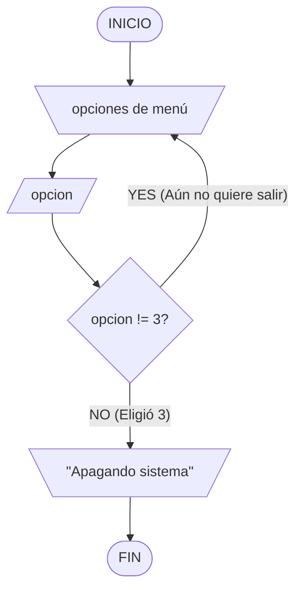
```mermaid
graph TD
    A(["INICIO"]) --> B[\"opciones de menú"/]
    B --> C[/"opcion"/]
    C --> D{"opcion != 3?"}
    D -- YES (Aún no quiere salir) --> B
    D -- NO (Eligió 3) --> E[\"#quot;Apagando sistema#quot;"/]
    E --> F(["FIN"])
```
**Prueba de escritorio (selección de opción 1 y luego 3):**
| Vuelta | Pantalla (Menú) | `opcion` | Condición (`!= 3`) | Acción lógica |
| :---: | :--- | :---: | :---: | :--- |
| 1 | "1. Sumar, 2. Restar, 3. Salir" | **1** | **SÍ (1 != 3)** | *Retorna a mostrar el menú* |
| 2 | "1. Sumar, 2. Restar, 3. Salir" | **3** | **NO (3 != 3 es Falso)** | *Termina el ciclo* |
| Salida| "Apagando sistema" | 3 | - | *Finaliza* |

#### Ejercicio HACER MIENTRAS 3: Adivinar un número secreto
**Descripción:** Solicitar intentos numéricos al usuario de forma continua hasta que coincida con el número secreto predefinido (7).

**Pseudocódigo:**
```text
INICIO
    secreto = 7
    HACER
        IMPRIMIR "Adivina el número secreto:"
        LEER intento
    MIENTRAS intento != secreto
    IMPRIMIR "¡Felicidades, ganaste!"
FIN
```
**Prueba de escritorio (intentos: 5 y luego 7):**
| Vuelta | `secreto` | Pantalla | `intento` | Condición (`!= secreto`) |
| :---: | :---: | :--- | :---: | :---: |
| Inicio| 7 | - | - | - |
| 1 | 7 | "Adivina el número:" | **5** | **SÍ (5 != 7)** |
| 2 | 7 | "Adivina el número:" | **7** | **NO (7 != 7 es Falso)** |
| Salida| 7 | "¡Felicidades, ganaste!"| 7 | - |

---

### 5.3 El ciclo PARA (bucle For)

Se utiliza cuando se conoce con exactitud el número de iteraciones requeridas, integrando la inicialización, la condición de parada y el incremento en una sola estructura de control.

- **Símbolo en DFD:** Hexágono alargado o bloque de control `{{ }}` que especifica la variable iteradora, el rango y el paso.
- **Sintaxis en pseudocódigo:** `PARA variable = inicio HASTA fin CON PASO valor HACER`.

#### Ejercicio FOR 1: Conteo ascendente del 1 al 10
**Descripción:** Imprimir en orden progresivo los números enteros del 1 al 10 utilizando un paso de incremento unitario.

**Pseudocódigo:**
```text
INICIO
    PARA i = 1 HASTA 10 CON PASO 1 HACER
        IMPRIMIR "El número actual es: " + i
    FIN PARA
FIN
```
**Diagrama de flujo:**
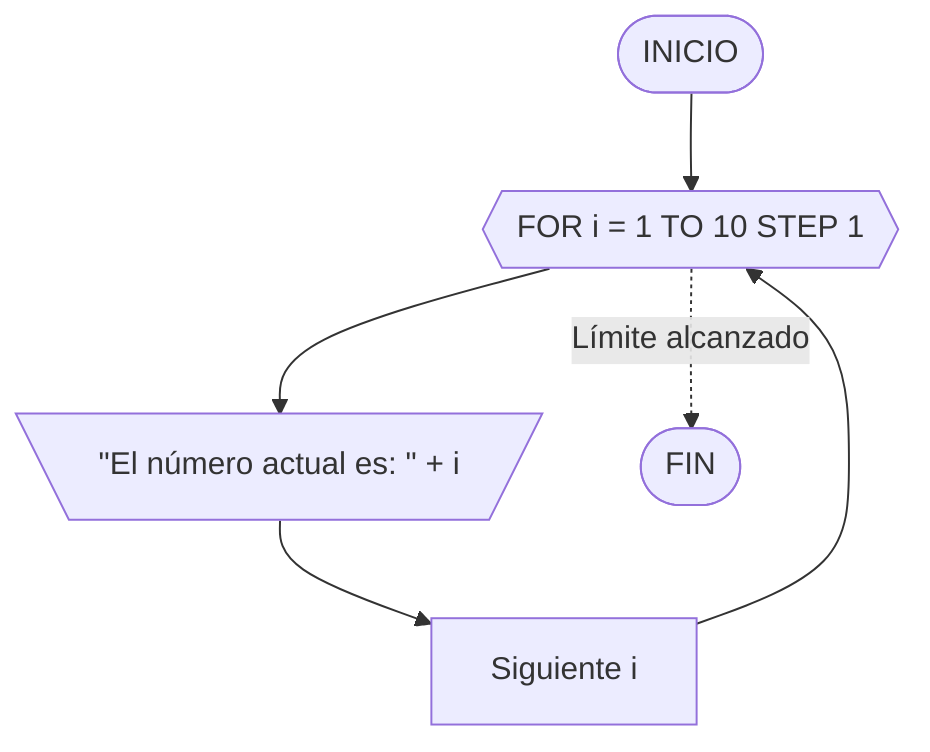
```mermaid
graph TD
    A(["INICIO"]) --> B{{"FOR i = 1 TO 10 STEP 1"}}
    B --> C[\"#quot;El número actual es: #quot; + i"/]
    C --> D["Siguiente i"]
    D --> B
    B -. Límite alcanzado .-> E(["FIN"])
```
**Prueba de escritorio:**
| Vuelta | Variable `i` (Automática) | Condición implícita | Pantalla |
| :---: | :---: | :---: | :--- |
| 1 | **1** | SÍ (1 <= 10) | "El número actual es: 1" |
| 2 | **2** | SÍ (2 <= 10) | "El número actual es: 2" |
| *(...)* | *...* | *...* | *...* |
| 10 | **10** | SÍ (10 <= 10) | "El número actual es: 10" |
| Salida| 11 | NO (11 <= 10 es Falso)| *Fin del programa* |

#### Ejercicio FOR 2: Cuenta regresiva descendente
**Descripción:** Generar una cuenta regresiva del 10 al 1 aplicando un paso negativo de `-1`, finalizando con un mensaje de despegue.

**Pseudocódigo:**
```text
INICIO
    PARA i = 10 HASTA 1 CON PASO -1 HACER
        IMPRIMIR "Lanzamiento en... " + i
    FIN PARA
    IMPRIMIR "¡Despegue!"
FIN
```
**Diagrama de flujo:**
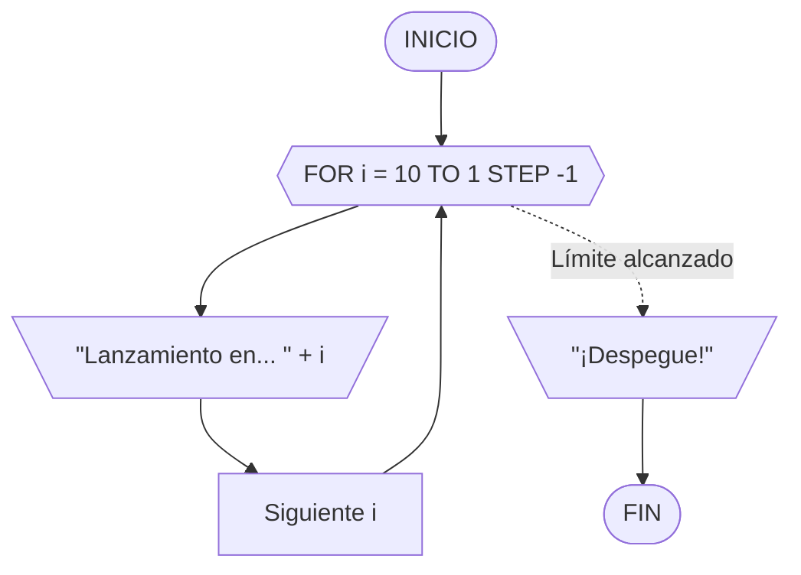
```mermaid
graph TD
    A(["INICIO"]) --> B{{"FOR i = 10 TO 1 STEP -1"}}
    B --> C[\"#quot;Lanzamiento en... #quot; + i"/]
    C --> D["Siguiente i"]
    D --> B
    B -. Límite alcanzado .-> E[\"#quot;¡Despegue!#quot;"/]
    E --> F(["FIN"])
```
**Prueba de escritorio:**
| Vuelta | Variable `i` | Condición implícita | Pantalla |
| :---: | :---: | :---: | :--- |
| 1 | **10** | SÍ (10 >= 1) | "Lanzamiento en... 10" |
| 2 | **9** | SÍ (9 >= 1) | "Lanzamiento en... 9" |
| *(...)* | *...* | *...* | *...* |
| 10 | **1** | SÍ (1 >= 1) | "Lanzamiento en... 1" |
| Salida| 0 | NO (0 >= 1 es Falso) | "¡Despegue!" |

#### Ejercicio FOR 3: Múltiplos de 5 con paso modificado
**Descripción:** Imprimir la serie numérica de múltiplos de 5 desde el 5 hasta el 50 mediante un incremento de 5 en cada iteración.

**Pseudocódigo:**
```text
INICIO
    PARA iterador = 5 HASTA 50 CON PASO 5 HACER
        IMPRIMIR "Valor: " + iterador
    FIN PARA
FIN
```
**Diagrama de flujo:**
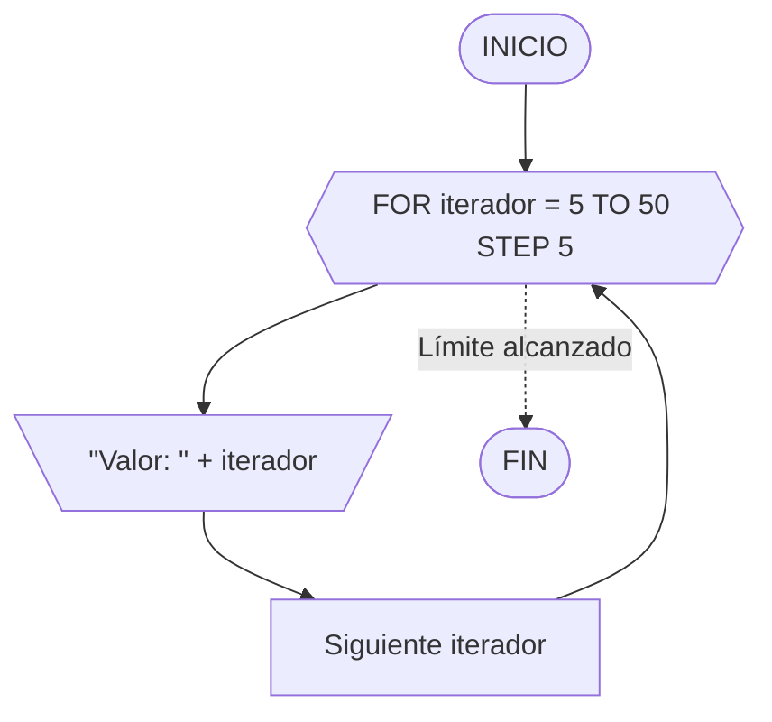
```mermaid
graph TD
    A(["INICIO"]) --> B{{"FOR iterador = 5 TO 50 STEP 5"}}
    B --> C[\"#quot;Valor: #quot; + iterador"/]
    C --> D["Siguiente iterador"]
    D --> B
    B -. Límite alcanzado .-> E(["FIN"])
```
**Prueba de escritorio:**
| Vuelta | `iterador` | Salto (+5) | Condición (`<= 50`) | Pantalla |
| :---: | :---: | :---: | :---: | :--- |
| 1 | **5** | +5 -> 10 | SÍ | "Valor: 5" |
| 2 | **10** | +5 -> 15 | SÍ | "Valor: 10" |
| *(...)* | *...* | *...* | *...* | *...* |
| 10 | **50** | +5 -> 55 | SÍ | "Valor: 50" |
| Salida| 55 | - | NO | *Fin del ciclo* |

#### Ejercicio FOR 4: Sumatoria acumulativa de 1 a N
**Descripción:** Sumar los números enteros consecutivos desde 1 hasta un valor límite `N` definido por el usuario, empleando una variable acumuladora.

**Pseudocódigo:**
```text
INICIO
    LEER numero_limite
    suma_total = 0
    PARA i = 1 HASTA numero_limite CON PASO 1 HACER
        suma_total = suma_total + i
    FIN PARA
    IMPRIMIR "La sumatoria total es: " + suma_total
FIN
```
**Diagrama de flujo:**
```mermaid
graph TD
    A(["INICIO"]) --> B[/"numero_limite"/]
    B --> C["suma_total = 0"]
    C --> D{{"FOR i = 1 TO numero_limite STEP 1"}}
    D --> E["suma_total = suma_total + i"]
    E --> F["Siguiente i"]
    F --> D
    D -. Límite alcanzado .-> G[\"#quot;La sumatoria total es: #quot; + suma_total"/]
    G --> H(["FIN"])
```
**Prueba de escritorio (sumando hasta N = 3):**
| Vuelta | `limite` | `i` | `suma_total` | Condición | Pantalla |
| :---: | :---: | :---: | :---: | :---: | :--- |
| Inicio| **3** | - | 0 | - | *Esperando N* |
| 1 | 3 | **1** | **1** (0+1) | SÍ (1<=3) | *Operación en memoria* |
| 2 | 3 | **2** | **3** (1+2) | SÍ (2<=3) | *Operación en memoria* |
| 3 | 3 | **3** | **6** (3+3) | SÍ (3<=3) | *Operación en memoria* |
| Salida| 3 | 4 | 6 | NO (4<=3) | "La sumatoria total es: 6" |

#### Ejercicio FOR 5: Búsqueda del valor máximo en lote
**Descripción:** Leer 5 registros de temperatura y determinar cuál fue el valor máximo observado, actualizando la variable `maximo` mediante una comparación en cada iteración.

**Pseudocódigo:**
```text
INICIO
    maximo = -9999
    PARA dia = 1 HASTA 5 CON PASO 1 HACER
        LEER temperatura
        SI temperatura > maximo ENTONCES
            maximo = temperatura
        FIN SI
    FIN PARA
    IMPRIMIR "La temperatura máxima de la semana fue: " + maximo
FIN
```
**Diagrama de flujo:**
```mermaid
graph TD
    A(["INICIO"]) --> B["maximo = -9999"]
    B --> C{{"FOR dia = 1 TO 5 STEP 1"}}
    C --> D[/"temperatura"/]
    D --> E{"temperatura > maximo?"}
    E -- YES --> F["maximo = temperatura"]
    E -- NO --> G["Siguiente dia"]
    F --> G
    G --> C
    C -. Límite alcanzado .-> H[\"#quot;La temperatura máxima... #quot; + maximo"/]
    H --> I(["FIN"])
```
**Prueba de escritorio (temperaturas: 25, 28, 22, 30, 29):**
| Vuelta | `dia` | `maximo` | `temperatura` | ¿Es > máximo? | Nuevo máximo |
| :---: | :---: | :---: | :---: | :---: | :---: |
| Inicio| - | -9999 | - | - | - |
| 1 | 1 | -9999 | **25** | SÍ (25 > -9999) | **25** |
| 2 | 2 | 25 | **28** | SÍ (28 > 25) | **28** |
| 3 | 3 | 28 | **22** | NO (22 <= 28) | 28 |
| 4 | 4 | 28 | **30** | SÍ (30 > 28) | **30** |
| 5 | 5 | 30 | **29** | NO (29 <= 30) | 30 |
| Salida| 6 | 30 | - | (Fin) | "La temperatura máxima... 30" |

#### Ejercicio FOR 6: Tabla de multiplicar
**Descripción:** Solicitar un número entero y mostrar su tabla de multiplicar del 1 al 10, calculando y formateando el producto en cada paso.

**Pseudocódigo:**
```text
INICIO
    LEER tabla_del
    PARA multiplicador = 1 HASTA 10 CON PASO 1 HACER
        resultado = tabla_del * multiplicador
        IMPRIMIR tabla_del + " x " + multiplicador + " = " + resultado
    FIN PARA
FIN
```
**Diagrama de flujo:**
```mermaid
graph TD
    A(["INICIO"]) --> B[/"tabla_del"/]
    B --> C{{"FOR multiplicador = 1 TO 10 STEP 1"}}
    C --> D["resultado = tabla_del * multiplicador"]
    D --> E[\"tabla_del + #quot; x #quot; + multiplicador + #quot; = #quot; + resultado"/]
    E --> F["Siguiente multiplicador"]
    F --> C
    C -. Límite alcanzado .-> G(["FIN"])
```
**Prueba de escritorio (tabla del 7):**
| Vuelta | `tabla_del` | `multiplicador` | `resultado` | Pantalla |
| :---: | :---: | :---: | :---: | :--- |
| Inicio| **7** | - | - | *Esperando número* |
| 1 | 7 | **1** | **7** | "7 x 1 = 7" |
| 2 | 7 | **2** | **14**| "7 x 2 = 14" |
| *(...)* | *...* | *...* | *...* | *...* |
| 10 | 7 | **10** | **70**| "7 x 10 = 70" |
| Salida| 7 | 11 | - | *Fin del ciclo* |

---

### 5.4 Ejercicios combinados con múltiples estructuras

En aplicaciones reales es común secuenciar o anidar distintos tipos de ciclos y condicionales según los requerimientos del problema.

#### Ejercicio Combinado 1: Validación previa con lectura múltiple (Hacer Mientras + Mientras)
**Descripción:** Validar que la cantidad de alumnos a procesar sea estrictamente mayor a cero y, posteriormente, solicitar la calificación individual de cada uno mediante un ciclo de control.

**Pseudocódigo:**
```text
INICIO
    HACER
        IMPRIMIR "Ingresa la cantidad de alumnos (mayor a 0):"
        LEER n_alumnos
    MIENTRAS n_alumnos <= 0
    
    contador = 1
    MIENTRAS contador <= n_alumnos HACER
        IMPRIMIR "Ingresa la calificación del alumno " + contador
        LEER calif
        contador = contador + 1
    FIN MIENTRAS
    IMPRIMIR "Todas las calificaciones registradas."
FIN
```
**Prueba de escritorio (entradas: -2, luego 2, y calificaciones 8 y 9):**
| Paso | Variable / Acción | Valor / Condición | Pantalla |
| :---: | :---: | :---: | :--- |
| Val 1 | `n_alumnos` | **-2** (Inválido: -2 <= 0) | "Ingresa cantidad de alumnos..." |
| Val 2 | `n_alumnos` | **2** (Válido: 2 <= 0 es Falso) | "Ingresa cantidad de alumnos..." |
| Ciclo 1| `contador` | 1 | "Ingresa la calificación del alumno 1" |
| Ciclo 1| `calif` | **8** | - |
| Ciclo 2| `contador` | 2 | "Ingresa la calificación del alumno 2" |
| Ciclo 2| `calif` | **9** | - |
| Fin | Salida | - | "Todas las calificaciones registradas." |

#### Ejercicio Combinado 2: Bucle interactivo con fases fijas (Mientras + Para)
**Descripción:** Recibir palabras de forma continua hasta que se ingrese `"FIN"`. Por cada palabra procesada, ejecutar un ciclo interno fijo de 3 pasos que emite asteriscos de confirmación.

**Pseudocódigo:**
```text
INICIO
    LEER palabra
    MIENTRAS palabra != "FIN" HACER
        IMPRIMIR "Analizando: " + palabra
        PARA fase = 1 HASTA 3 CON PASO 1 HACER
            IMPRIMIR "*"
        FIN PARA
        IMPRIMIR "Análisis completado."
        LEER palabra
    FIN MIENTRAS
FIN
```
**Prueba de escritorio (ingreso de "Hola" y luego "FIN"):**
| Paso | Variable | Valor | Pantalla |
| :---: | :---: | :---: | :--- |
| Mientras | `palabra` | **"Hola"** | *Esperando texto* |
| Mientras | Condición | SÍ ("Hola" != "FIN") | "Analizando: Hola" |
| Para | `fase` 1 | 1 | "*" |
| Para | `fase` 2 | 2 | "*" |
| Para | `fase` 3 | 3 | "*" |
| Para | Fin | - | "Análisis completado." |
| Mientras | `palabra` | **"FIN"** | *Esperando texto* |
| Mientras | Condición | NO (Término del ciclo) | *Finaliza el programa* |

#### Ejercicio Combinado 3: Menú interactivo con secuencias ascendente y descendente (Hacer Mientras + Para)
**Descripción:** Desplegar un menú que permite contar del 1 al 3 (opción 1), del 3 al 1 (opción 2) o salir del sistema (opción 3), empleando condicionales anidados dentro de una estructura repetitiva.

**Pseudocódigo:**
```text
INICIO
    HACER
        IMPRIMIR "1. Subir, 2. Bajar, 3. Salir"
        LEER opc
        SI opc == 1 ENTONCES
            PARA i = 1 HASTA 3 CON PASO 1 HACER
                IMPRIMIR "Subiendo... " + i
            FIN PARA
        SINO
            SI opc == 2 ENTONCES
                PARA i = 3 HASTA 1 CON PASO -1 HACER
                    IMPRIMIR "Bajando... " + i
                FIN PARA
            FIN SI
        FIN SI
    MIENTRAS opc != 3
    IMPRIMIR "Apagado"
FIN
```
**Prueba de escritorio (opción 1 y luego opción 3):**
| Paso | Acción / Variable | Valor | Pantalla |
| :---: | :---: | :---: | :--- |
| Menú | `opc` | **1** | "1. Subir, 2. Bajar, 3. Salir" |
| Cond | Evaluar opción 1 | SÍ (1 == 1) | - |
| Para 1| `i` (Vueltas 1, 2, 3) | 1..3 | "Subiendo... 1", "Subiendo... 2", "Subiendo... 3" |
| Bucle| Retorno del menú | SÍ (1 != 3) | *Vuelve al menú principal* |
| Menú | `opc` | **3** | "1. Subir, 2. Bajar, 3. Salir" |
| Cond | Evaluar opción 3 | NO (a 1 y a 2) | - |
| Bucle| Retorno del menú | NO (3 != 3 es Falso) | "Apagado" |

---

## 6. Clasificación de errores en la programación

Al diseñar e implementar algoritmos se presentan distintos tipos de errores según la etapa en la que se manifiestan y la herramienta capaz de detectarlos:

1. **Errores de sintaxis:**
   Ocurren al infringir las reglas gramaticales o de estructura del lenguaje (por ejemplo, omitir el cierre de comillas o escribir incorrectamente una palabra reservada como `IMPRIMR`). El compilador o intérprete los identifica antes de la ejecución y señala la línea donde se originan.

2. **Errores de ejecución (Runtime errors):**
   Aparecen cuando las instrucciones son sintácticamente válidas, pero solicitan operaciones no permitidas durante el funcionamiento del programa, tales como intentar dividir entre cero o acceder a un recurso no disponible.

3. **Errores lógicos:**
   Se presentan cuando el programa se ejecuta sin interrupciones pero entrega resultados incorrectos debido a una falla en el razonamiento, las fórmulas o el flujo de control. Las herramientas automáticas no pueden detectarlos directamente, por lo que su prevención y corrección dependen de la prueba de escritorio y del análisis del desarrollador.

### 6.1 Tiempo de compilación vs. tiempo de ejecución

Para comprender la naturaleza de estos errores es útil distinguir las dos etapas principales en el ciclo de un programa:

- **Tiempo de compilación (Compile Time):**
  Fase previa en la que el compilador analiza el código fuente, valida su sintaxis y lo traduce a instrucciones ejecutables. Los errores de sintaxis se identifican exclusivamente en este momento, impidiendo la generación del programa final hasta ser corregidos.

- **Tiempo de ejecución (Run Time):**
  Fase en la que el programa compilado o interpretado se ejecuta en la memoria de la computadora, procesa entradas y genera salidas. En esta etapa se manifiestan los errores de ejecución y se observan las consecuencias de los errores lógicos.

### 6.2 Errores lógicos y de control comunes en diagramas

Durante el diseño de algoritmos iterativos suelen presentarse situaciones específicas que conviene anticipar:

- **Bucle infinito:** Se produce cuando la condición de salida depende de una variable cuyo valor nunca cambia dentro del ciclo (por ejemplo, al omitir el incremento `contador = contador + 1`), provocando que la condición sea siempre verdadera.
- **Ciclo inactivo:** Ocurre en estructuras `MIENTRAS` cuando la variable de control se inicializa con un valor que hace falsa la condición de entrada desde el primer momento, omitiendo el bloque por completo.
- **Error por desplazamiento de un paso (Off-by-One):** Sucede al confundir operadores como `<` y `<=`, lo que ocasiona que el ciclo realice una iteración más o una menos de las previstas.
- **División por cero no controlada:** Ocurre cuando se calcula un promedio o tasa sin validar previamente si el divisor es cero (por ejemplo, con `N = 0`), lo cual genera una interrupción de ejecución si no se añade una verificación previa.

---

## 7. Ejercicio Integrador: Cajero automático básico

A continuación se presenta un ejercicio que combina las principales estructuras abordadas: ciclo `HACER MIENTRAS` para la navegación del menú, condicionales anidados para la validación de fondos y ciclo `PARA` para la rutina final de desconexión.

**Planteamiento:**
Diseñar un sistema de cajero automático con un saldo inicial de 1000 unidades monetarias que cumpla con los siguientes puntos:

1. Desplegar un menú interactivo continuo con tres opciones: 1. Consultar saldo, 2. Realizar retiro, 3. Salir.
2. Al seleccionar retiro, solicitar el monto y verificar que no exceda el saldo disponible; si los fondos son suficientes, actualizar el saldo, y en caso contrario, mostrar un mensaje de fondos insuficientes.
3. Al elegir la opción de salida (3), ejecutar un ciclo de 3 pasos que simule la desconexión del servidor y emitir un mensaje de agradecimiento.

**Pseudocódigo:**
```text
INICIO
    saldo = 1000
    HACER
        IMPRIMIR "1. Consultar"
        IMPRIMIR "2. Retirar"
        IMPRIMIR "3. Salir"
        LEER opcion
        
        SI opcion == 1 ENTONCES
            IMPRIMIR "Tu saldo es: " + saldo
        SINO
            SI opcion == 2 ENTONCES
                IMPRIMIR "Ingresa monto a retirar:"
                LEER retiro
                SI retiro <= saldo ENTONCES
                    saldo = saldo - retiro
                    IMPRIMIR "Retiro exitoso. Nuevo saldo: " + saldo
                SINO
                    IMPRIMIR "Fondos insuficientes"
                FIN SI
            FIN SI
        FIN SI
    MIENTRAS opcion != 3
    
    IMPRIMIR "Iniciando protocolo de desconexión..."
    PARA fase = 1 HASTA 3 CON PASO 1 HACER
        IMPRIMIR "Cerrando fase de seguridad: " + fase
    FIN PARA
    IMPRIMIR "Gracias por usar nuestro banco"
FIN
```
**Diagrama de flujo:**
```mermaid
graph TD
    A(["INICIO"]) --> B["saldo = 1000"]
    B --> C[/"menú y opcion"/]
    C --> D{"opcion == 1?"}
    D -- YES --> E[\"saldo"/]
    D -- NO --> F{"opcion == 2?"}
    F -- YES --> G[/"retiro"/]
    G --> H{"retiro <= saldo?"}
    H -- YES --> I["saldo = saldo - retiro<br>#quot;Retiro exitoso#quot;"]
    H -- NO --> J[\"#quot;Fondos insuficientes#quot;"/]
    I --> K
    J --> K
    E --> K{"opcion != 3?"}
    F -- NO --> K
    
    K -- YES (Repetir Menú) --> C
    K -- NO (Salir) --> L[\"#quot;Iniciando protocolo...#quot;"/]
    
    L --> M{{"FOR fase = 1 TO 3 STEP 1"}}
    M --> N[\"#quot;Cerrando fase... #quot; + fase"/]
    N --> O["Siguiente fase"]
    O --> M
    M -. Límite alcanzado .-> P[\"#quot;Gracias#quot;"/]
    P --> Q(["FIN"])
```
**Prueba de escritorio (intento de retiro de 1500, retiro de 200, consulta de saldo y salida):**
| Paso | Acción lógica / Variable | Valor | Pantalla (Salida) |
| :---: | :--- | :---: | :--- |
| Inicio| `saldo` inicial | 1000 | - |
| **B1**| **--- Menú principal ---** | - | "1. Consultar, 2. Retirar, 3. Salir" |
| Leer 1| `opcion` | **2** | *Esperando opción* |
| Cond | ¿Opción 2? | SÍ | "Ingresa monto a retirar:" |
| Leer | `retiro` | **1500** | *Esperando monto* |
| Cond | ¿`retiro` <= `saldo`? (1500 <= 1000) | NO | "Fondos insuficientes" |
| Eval | ¿`opcion` != 3? | SÍ | *Retorna al menú* |
| **B2**| **--- Menú principal ---** | - | "1. Consultar, 2. Retirar, 3. Salir" |
| Leer 2| `opcion` | **2** | *Esperando opción* |
| Cond | ¿Opción 2? | SÍ | "Ingresa monto a retirar:" |
| Leer | `retiro` | **200** | *Esperando monto* |
| Cond | ¿`retiro` <= `saldo`? (200 <= 1000) | SÍ | *Operación en memoria* |
| Proc | `saldo` (1000 - 200) | **800** | "Retiro exitoso. Nuevo saldo: 800" |
| Eval | ¿`opcion` != 3? | SÍ | *Retorna al menú* |
| **B3**| **--- Menú principal ---** | - | "1. Consultar, 2. Retirar, 3. Salir" |
| Leer 3| `opcion` | **1** | *Esperando opción* |
| Cond | ¿Opción 1? | SÍ | "Tu saldo es: 800" |
| Eval | ¿`opcion` != 3? | SÍ | *Retorna al menú* |
| **B4**| **--- Menú principal ---** | - | "1. Consultar, 2. Retirar, 3. Salir" |
| Leer 4| `opcion` | **3** | *Esperando opción* |
| Eval | ¿`opcion` != 3? | NO | *Concluye el menú* |
| Salida| Fin del menú | - | "Iniciando protocolo de desconexión..."|
| Para | `fase` = 1 | 1 | "Cerrando fase de seguridad: 1" |
| Para | `fase` = 2 | 2 | "Cerrando fase de seguridad: 2" |
| Para | `fase` = 3 | 3 | "Cerrando fase de seguridad: 3" |
| Fin | Mensaje final | - | "Gracias por usar nuestro banco" |

---

## 8. Recomendaciones y siguientes pasos

El diseño de algoritmos parte de instrucciones elementales y avanza hacia estructuras organizadas mediante reglas claras de flujo. Para consolidar esta práctica, se sugieren las siguientes recomendaciones:

- **Herramientas de diagramación:** Para diagramar de forma digital pueden utilizarse herramientas como **yEd Graph Editor**, **Draw.io** o **Lucidchart**, así como el dibujo tradicional en papel manteniendo la consistencia de los símbolos estándar.
- **Verificación constante:** Aplicar la prueba de escritorio a cada solución permite detectar inconsistencias lógicas y evaluar casos límite antes de pasar a la codificación.
- **Estructuras de datos colectivas:** Tras dominar variables simples, el siguiente paso comprende el uso de **arreglos (arrays)** o **listas**, los cuales permiten almacenar y procesar conjuntos múltiples de datos bajo un mismo identificador.
- **Modularidad:** Conforme aumenta la complejidad de los programas, las operaciones repetitivas o extensas se organizan en subprocesos independientes (**funciones y métodos**), facilitando el mantenimiento y la reutilización del código.

---

## 9. Referencias bibliográficas de consulta

1. **Joyanes Aguilar, L. (2008).** *Fundamentos de programación: Algoritmos, estructuras de datos y objetos* (4.ª ed.). McGraw-Hill Interamericana.
2. **Cairó Battistutti, O. (2005).** *Metodología de la programación: Algoritmos, diagramas de flujo y programas* (3.ª ed.). Alfaomega.
3. **Cormen, T. H., Leiserson, C. E., Rivest, R. L., & Stein, C. (2009).** *Introduction to Algorithms* (3.ª ed.). MIT Press.
